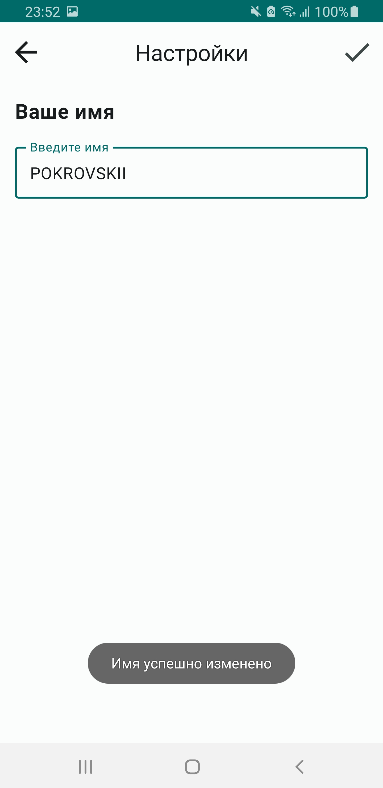
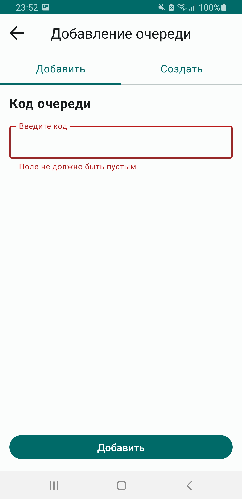
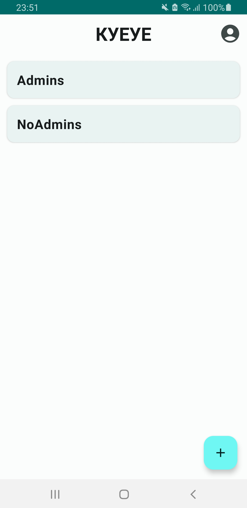
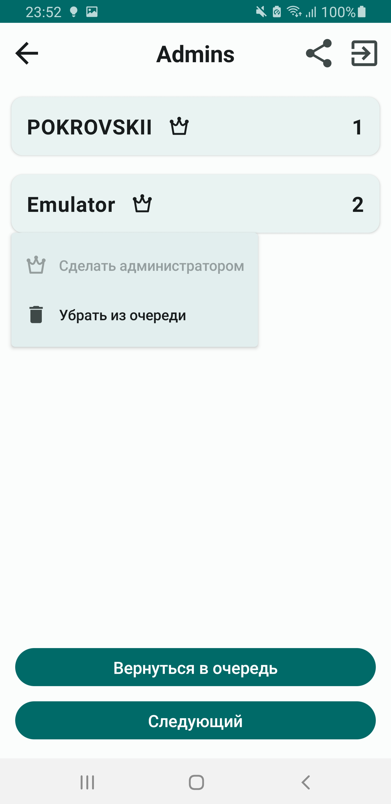

**КУЕУЕ (QUEUES) - Android-приложение для электронной очереди**

Приложение обладает следующей **функциональностью**:
1. Регистрация (по почте и паролю)

2. Вход  
3. Смена ника

4. Создание очереди (с возможностью сделать всех пользователей администраторами)

5. Главный экран со всеми Вашими очередями

6. Экран очереди

**Технологический стек:**
1. Kotlin
2. Jetpack Compose
3. Coroutines
4. Firebase Firestore + Auth
5. Dagger Hilt
6. RoomORM
7. Compose Navigation

Приложение создаено в соответствии с паттерном проектирования **MVVM**
